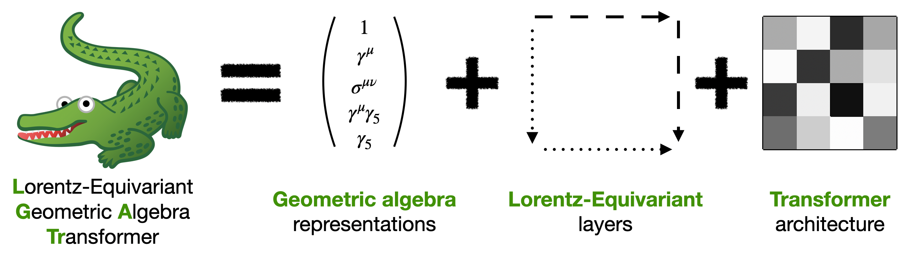

<div align="center">

## Lorentz-Equivariant Geometric Algebra Transformer

[](https://github.com/heidelberg-hepml/lgatr/actions/workflows/tests.yaml)
[](https://codecov.io/gh/heidelberg-hepml/lgatr)
[](https://pypi.org/project/lgatr)
[](https://pytorch.org/get-started/locally/)
[](https://black.readthedocs.io/en/stable/)

[](https://arxiv.org/abs/2405.14806)
[](https://arxiv.org/abs/2411.00446)

</div>

This repository contains a standalone implementation of the **Lorentz-Equivariant Geometric Algebra Transformer (L-GATr)** by [Jonas Spinner](mailto:j.spinner@thphys.uni-heidelberg.de), [Víctor Bresó](mailto:breso@thphys.uni-heidelberg.de), Pim de Haan, Tilman Plehn, Huilin Qu, Jesse Thaler, and Johann Brehmer. L-GATr uses spacetime geometric algebra representations to construct Lorentz-equivariant layers and combines them into a transformer architecture.
You can read more about L-GATr in the following two papers and in the [L-GATr documentation](https://heidelberg-hepml.github.io/lgatr/):
- [Lorentz-Equivariant Geometric Algebra Transformers for High-Energy Physics](https://arxiv.org/abs/2405.14806) (ML audience)
- [A Lorentz-Equivariant Transformer for All of the LHC](https://arxiv.org/abs/2411.00446) (HEP audience)



## Installation

You can either install the latest release using pip
```
pip install lgatr
```
or clone the repository and install the package in dev mode
```
git clone https://github.com/heidelberg-hepml/lgatr.git
cd lgatr
pip install -e .
```

## How to use L-GATr

Please have a look at our example notebooks for how to use [LGATr](examples/demo_lgatr.ipynb) and [ConditionalLGATr](examples/demo_conditional_lgatr).

## Features

- L-GATr encoder and decoder as `LGATr` and `ConditionalLGATr`
- Additional attention backends, installation via `pip install lgatr[xformers_attention]` and `pip install lgatr[flex_attention]`. You might have to run `python -m pip install --upgrade pip setuptools wheel
` because extra imports require modern versions of `pip, setuptools, wheel`.
- Support for torch's automatic mixed precision; critical operations are performed in `float32`
- Interface to the geometric algebra: Embedding and extracting multivectors; spurions for symmetry breaking at the input level
- Many hyperparameters to play with, organized via the `SelfAttentionConfig`, `CrossAttentionConfig`, `MLPConfig` and `LGATRConfig` objects

## Examples

- https://github.com/spinjo/weaver-core/blob/lgatr/weaver/nn/model/LGATr.py: L-GATr in the CMS boosted object tagging library `weaver`
- https://github.com/heidelberg-hepml/lorentz-gatr: Original `LGATr` implementation used for the papers

Let us know if you use `lgatr`, so we can add your repo to the list!

## Citation

If you find this code useful in your research, please cite the following papers

```bibtex
@article{Brehmer:2024yqw,
    author = "Brehmer, Johann and Bres\'o, V\'\i{}ctor and de Haan, Pim and Plehn, Tilman and Qu, Huilin and Spinner, Jonas and Thaler, Jesse",
    title = "{A Lorentz-Equivariant Transformer for All of the LHC}",
    eprint = "2411.00446",
    archivePrefix = "arXiv",
    primaryClass = "hep-ph",
    reportNumber = "MIT-CTP/5802",
    month = "11",
    year = "2024"
}
@inproceedings{spinner2025lorentz,
  title={Lorentz-Equivariant Geometric Algebra Transformers for High-Energy Physics},
  author={Spinner, Jonas and Bres{\'o}, Victor and De Haan, Pim and Plehn, Tilman and Thaler, Jesse and Brehmer, Johann},
  booktitle={Advances in Neural Information Processing Systems},
  year={2024},
  volume={37},
  eprint = {2405.14806},
  url = {https://arxiv.org/abs/2405.14806}
}
@inproceedings{brehmer2023geometric,
  title = {Geometric Algebra Transformer},
  author = {Brehmer, Johann and de Haan, Pim and Behrends, S{\"o}nke and Cohen, Taco},
  booktitle = {Advances in Neural Information Processing Systems},
  year = {2023},
  volume = {36},
  eprint = {2305.18415},
  url = {https://arxiv.org/abs/2305.18415},
}
```

